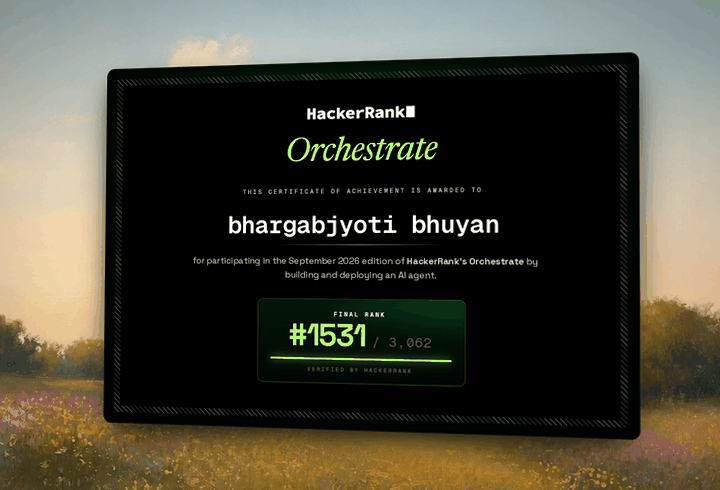
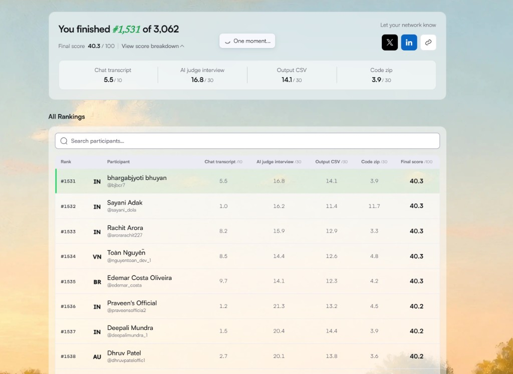

# Buy or Wait

Financial decision agent built for [HackerRank Orchestrate](https://www.hackerrank.com/hackerrank-orchestrate-september26) (September 2026).

The prompt is *“Can I afford this?”* Balance alone is not enough. The agent looks at recurring bills, pending payments, min-balance preference, FX, installment offers, and evidence in messages and receipts — then recommends pay in full, split, installments, wait, or don’t.

## Result

HackerRank Orchestrate, September 2026: **#1531 / 3,062**.

<p align="center">
  
</p>

<p align="center">
  
</p>

## What it outputs

For each request: `amount_safe_to_pay`, affordability status, payment method, dated `payment_plan`, earliest safe full-pay date, optional spending changes, and a short explanation.

## Approach

Affordability is treated as a **90-day cash-flow problem**, not a chat vote.

1. Load profiles, events, payment options, and dated FX into home currency.
2. Patch facts from images (cached amounts) and messages (rules). Messages never override contest rules or invent income.
3. Simulate the balance path. A plan is safe only if it stays above `minimum_balance_to_keep`.
4. Rank eligible safe plans: complete by the deadline, prefer no spending cuts, lower total paid, earlier start, fewer payments, then lowest option id.

Python 3.10+, standard library. Optional OCR (`pytesseract`, Pillow) if you are not using the cached image totals. No live banking or FX APIs.

## Run

Place the Orchestrate `dataset/` folder next to this README (not shipped here — it is contest data).

```bash
python code/main.py
```

Writes `output.csv` at the repo root.

Score the 25 labeled samples:

```bash
python code/evaluation/main.py
```

## Layout

```text
code/main.py              entry point
code/agent/loaders.py     CSV load
code/agent/fx.py          dated FX
code/agent/evidence.py    image/message patches
code/agent/forecast.py    90-day simulation
code/agent/planner.py     candidates + ranking
code/agent/explain.py     explanations
code/evaluation/          sample scorer + usage report
```

The full 250-row run used **zero model calls**. Image totals were cached; ranking did not depend on an API key.
